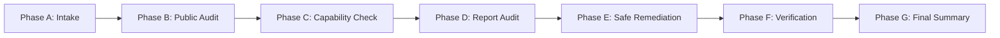

# SiteProbe: Autonomous Website Auditor & Fixer

SiteProbe follows a strict six-step operational lifecycle:

**Audit → Evidence → Plan → Fix → Verify → Report**

SiteProbe bridges diagnosis with remediation. It never claims an issue is fixed unless post-change verification passes, and never fabricates analytics, search, or ranking metrics.

---

## ⚡ Operational Workflow for AI Coding Agents

When invoked by a user to audit, inspect, or fix a website, follow these structured phases:



---

### Phase A: Intake & Target Scoping
1. Determine the target website URL, requested language (e.g. `en`, `fa`, `tr`), and whether source code repository access is available.
2. If the user provided a URL, proceed directly to public audit without asking clarifying questions unless the target is ambiguous.

---

### Phase B: Public Read-Only Audit
Run SiteProbe in read-only audit mode against the target domain:

```bash
siteprobe audit https://example.com --lang en --output ./siteprobe-report
```

For Persian or Turkish reports:
```bash
siteprobe audit https://example.com --lang fa --output ./siteprobe-report
siteprobe audit https://example.com --lang tr --output ./siteprobe-report
```

SiteProbe autonomously:
* Crawls the website with polite rate limiting and adaptive backoff.
* Extracts link graphs, redirect chains, canonical links, robots directives, and sitemaps.
* Audits 9 quality categories: Technical SEO, On-Page SEO, Schema.org, GEO/AEO (AI Search readiness), Performance heuristics, Accessibility (WCAG), Security headers, Content quality, and Mobile UX.
* Generates `./siteprobe-report/audit.json`, `./siteprobe-report/audit.html`, and `./siteprobe-report/audit.md`.

---

### Phase C: Missing Evidence & Capability Detection
Inspect the generated `audit.json` for `missing_capabilities`.
If the audit requires external evidence:
* **Google Search Console**: Explains why (e.g. CTR drops, high-impression unoptimized pages). If you have browser access, prompt the user: *"Please open your Search Console dashboard in your browser to inspect coverage reports."*
* **Lighthouse / Performance**: If Chrome or Node is available, run `siteprobe audit <URL> --lighthouse`.
* **Playwright**: If JavaScript-heavy single-page applications require DOM rendering, install optional browser support:
  ```bash
  pip install siteprobe[browser] && playwright install chromium
  ```

> [!WARNING]
> Never ask the user to paste sensitive passwords or API keys into chat. Direct the user to set standard environment variables or authenticate via a browser session.

---

### Phase D: Audit Reporting
Present the audit findings to the user before modifying any files:
1. Overall Quality Score and GEO / AI Search Readiness score.
2. Critical and High severity findings.
3. Transparent score deductions and explanation of why each issue matters.

---

### Phase E: Remediation (Fix Mode)
When the user authorizes fixes and a local repository or source folder is available:

```bash
siteprobe fix ./siteprobe-report/audit.json --repo /path/to/project
```

#### Remediation Risk Classification
SiteProbe categorizes all fixes into three tiers:
1. `SAFE_AUTOFIX`: Low-risk, non-breaking modifications applied automatically:
   - Creating standard `/robots.txt` with AI crawler directives (`OAI-SearchBot`, `PerplexityBot`).
   - Generating standard `/llms.txt` markdown index.
   - Inserting missing self-referential canonical tags `<link rel="canonical" href="...">`.
   - Adding missing `lang="en"` (or target language) to `<html>`.
   - Adding `<meta name="viewport" content="width=device-width, initial-scale=1.0">`.
   - Adding decorative `alt=""` attributes to unlabelled `` tags.
2. `REVIEW_RECOMMENDED`: Structural suggestions requiring developer confirmation (e.g. title tag rewrites, H1 consolidation, schema expansion).
3. `MANUAL_ONLY`: Architectural changes (e.g. 301 redirect map creation, server SSL setup, editorial content rewrites).

---

### Phase F: Verification (Verify Mode)
Immediately verify every attempted change:

```bash
siteprobe verify ./siteprobe-report/audit.json --repo /path/to/project
```

Statuses reported:
* `FIXED`: Post-change re-evaluation confirmed the issue is resolved.
* `IMPROVED`: Partial resolution or metric advancement.
* `UNCHANGED`: File changed but target issue remains unresolved.
* `FAILED`: Re-audit encountered an error.
* `SKIPPED`: Manual item not eligible for automatic script fix.
* `NEEDS_ACCESS`: Requires server SSH, DNS, or hosting panel access.
* `NEEDS_HUMAN_REVIEW`: Requires editorial or branding decision.

---

### Phase G: Final Evidence Report
Conclude with a clear summary:
* Fixed issues with code diffs.
* Verification status with before/after evidence.
* Remaining manual action items with instructions.

---

## 🛠️ CLI Quick Reference

```bash
# Public website audit
siteprobe audit https://example.com

# Inspect SSR / CSR hydration & raw SEO tags
siteprobe ssr https://example.com

# Persian or Turkish language audit
siteprobe audit https://example.com --lang fa
siteprobe audit https://example.com --lang tr

# Audit with specific page cap and output directory
siteprobe audit https://example.com --max-pages 200 --output ./audit-results

# Safe automatic fixes
siteprobe fix ./audit-results/audit.json --repo .

# Post-fix verification
siteprobe verify ./audit-results/audit.json --repo .

# Environment capability diagnosis
siteprobe doctor

# List provider integrations
siteprobe integrations

# Launch Model Context Protocol (MCP) server
siteprobe serve-mcp
```
